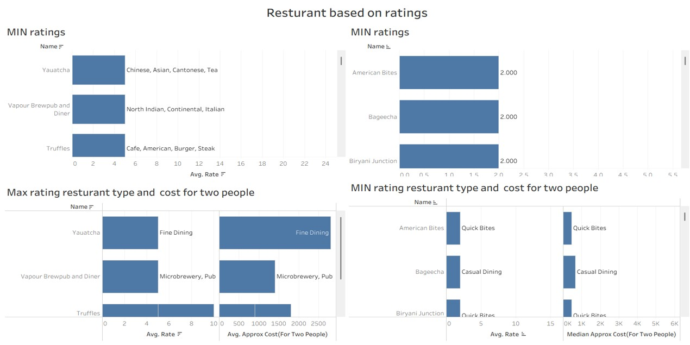
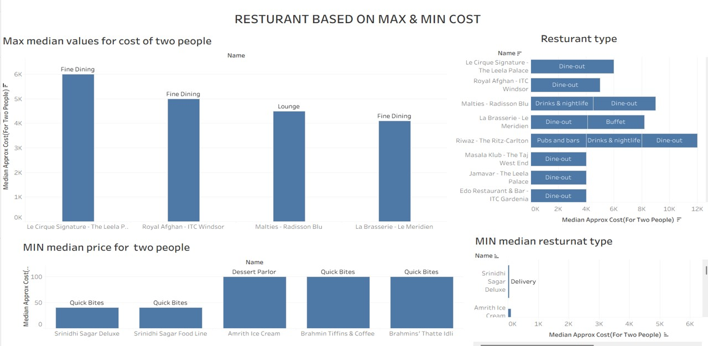

# Zomato Restaurant Data Analysis Case Study

## Project Overview
This project presents a comprehensive, end-to-end data analytics case study examining Zomato restaurant data. The primary objective is to evaluate pricing dynamics, customer satisfaction drivers, and market segments to provide data-backed insights for stakeholders and investors in the food and beverage industry.

## Data Source & Integrity
* **Source:** Downloaded from Kaggle

## Business Problem
How do restaurant pricing tiers, service types, and quality benchmarks influence customer ratings and satisfaction, and what key economic thresholds must new market entrants navigate to succeed.

## Data Source & Integrity (ROCC Framework)
* **Reliable:** Sourced from a clean, structured repository on Kaggle.
* **Original:** Third-party dataset capturing rich restaurant metadata.
* **Comprehensive:** Features critical dimensions including restaurant names, ratings, votes, cuisines, service types, and median costs.
* **Current:** Reflects relevant modern dining trends.
* **Cited:** Sourced from Kaggle under the **CC0: Public Domain** license.

## 1. Prepare & Process Phase (Data Cleaning & Transformation)
The raw dataset underwent rigorous cleaning and transformation using **Excel Power Query** to ensure data integrity (~19,000 clean rows retained):
* **Column Optimization:** Removed redundant or unnecessary columns (`url`, `phone`, `menu_items`, `reviews_list`, `table_booked`, `address`).
* **Handling Missing Values:** Dropped rows with missing critical attributes to prevent skewing analytical models.
* **Data Type Formatting:** Standardized the `approx_cost(for two people)` column into numeric data types, preserving currency context while allowing accurate numerical aggregation.

## 2. Key Performance Indicators (KPIs) & Metrics
* **Ratings:** Evaluated using averages and extremes to benchmark quality thresholds (e.g., 3.0 baseline vs. top-performing tiers).
* **Votes:** Served as a proxy for customer volume and popularity.
* **Median Cost:** Utilized the **median** instead of sums or averages to accurately represent typical consumer spending (ranging from budget spots at ~40 to fine dining at 6,000) while mitigating fine-dining outlier distortion.
* **Cuisines & Location:** Segmented by city areas and establishment categories (`rest_type` and `listed_in(type)`).

## 3. Dashboard Visualization & Findings
The final insights were compiled into an interactive **Tableau Public** dashboard visualizing pricing extremes, rating distributions, and establishment formats.

## Conclusions & Business Recommendations
* **Food Quality Drives Ratings:** The analysis reveals that customer ratings depend primarily on food quality and restaurant type (e.g., Fine Dining vs. Quick Bites) rather than price point or branding alone. Expensive venues offer superior physical space, but quality execution dictates satisfaction.
* **Pricing Spectrum:** Market pricing for two people spans from a minimum median cost of ~40 up to 6,000. 
* **Strategic Recommendation:** To optimize customer acquisition and ratings, new entrants should maintain competitive, mid-tier pricing paired with exceptional food quality and appropriate service formats. Further consumer surveys are recommended for localized granularity.

## Tools Used
* **Data Cleaning & Transformation:** Excel (Power Query)
* **Data Visualization & Dashboarding:** Tableau Public
* **Version Control & Documentation:** GitHub
